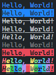

<!-- @format -->


[](https://discord.gg/teNWyb69dq)


[](https://wakatime.com/badge/user/0eeef1b5-98a7-4ec0-ab4c-db00536d5ed1/project/5ee8b6e6-942e-455f-ae9c-65536165f83a)


_Because chalk does not work in windows terminals..._

# Highlights

> - Fast
> - Lightweight
> - Easy to use
> - Customizable
> - TypeScript Types
> - ESM & CJS support
> - Works on all machines
> - No dependencies

## Install

```cmd
npm install sharpyy
```

## How-To-Use

```ts
import { Style } from 'sharpyy'

// Anything passed after the first argument is a style. You can combine every style available.
sharpyy(text:string, ...style:Array<keyof typeof Style | Style>)

// Style is an enum and you can pass both a string value as well as a enum key.
```

## Usage

```ts
// ESM
import sharpyy from 'sharpyy';

console.log(sharpyy('Hello, World!', 'invisible'));

// Use tx<Colorname> for text color.
console.log(sharpyy('Hello, World!', 'txBlue'));

// Use bg<Colorname> for background color.
console.log(sharpyy('Hello, World!', 'bgBlue'));

// It does not stop at colors...
console.log(sharpyy('Hello, World!', 'strikethrough'));

console.log(sharpyy('Hello, World!', 'underline'));

console.log(sharpyy('Hello, World!', 'italic'));

console.log(sharpyy('Hello, World!', 'dim'));

// combine multiple effects
console.log(sharpyy('Hello, World!', 'txRed', 'bold', 'underline', 'inverse'));

// You like rainbows?
console.log(sharpyy('Hello, World!', 'rainbow', 'bold', 'underlines', 'italic'));

console.log(sharpyy('Hello, World!', 'bgRainbow', 'bold', 'underlines', 'italic'));
```



```ts
// CJS
const { default: sharpyy } = require('sharpyy');

console.log(sharpyy('Hello, World!', 'invisible'));

// Use tx<Colorname> for text color.
console.log(sharpyy('Hello, World!', 'txBlue'));

// Use bg<Colorname> for background color.
console.log(sharpyy('Hello, World!', 'bgBlue'));

// It does not stop at colors...
console.log(sharpyy('Hello, World!', 'strikethrough'));

console.log(sharpyy('Hello, World!', 'underline'));

console.log(sharpyy('Hello, World!', 'italic'));

console.log(sharpyy('Hello, World!', 'dim'));

// combine multiple effects
console.log(sharpyy('Hello, World!', 'txRed', 'bold', 'underline', 'inverse'));

// You like rainbows?
console.log(sharpyy('Hello, World!', 'rainbow', 'bold', 'underlines', 'italic'));

console.log(sharpyy('Hello, World!', 'bgRainbow', 'bold', 'underlines', 'italic'));
```


## Styles

> - normal
> - bold
> - dim
> - italic
> - underline
> - inverse
> - invisible
> - strikethrough
> - underlines

## Text Colors

> - txGray
> - txRed
> - txGreen
> - txYellow
> - txBlue
> - txMagenta
> - txCyan
> - txWhite
> - rainbow

## Background Colors

> - bgGray
> - bgRed
> - bgGreen
> - bgYellow
> - bgBlue
> - bgMagenta
> - bgCyan
> - bgWhite
> - bgRainbow
